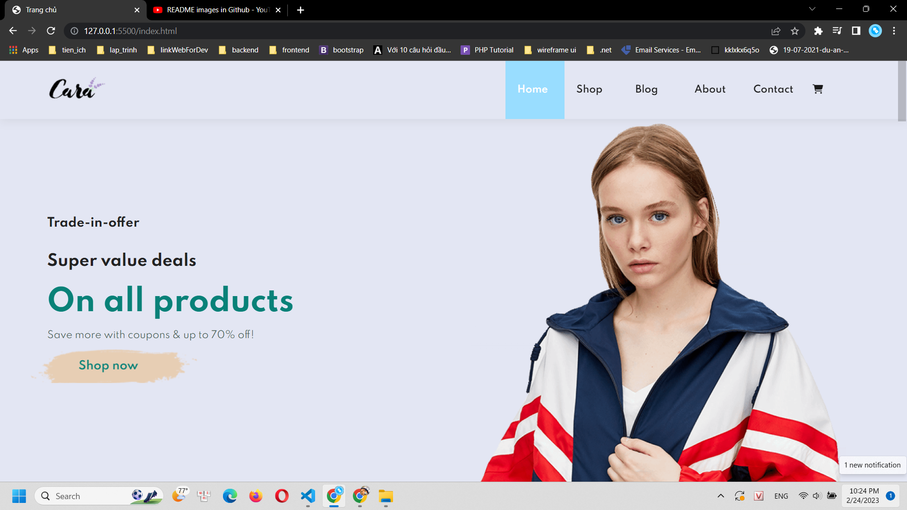

# Build-and-Deploy-Ecommerce-Website-With-HTML-CSS-JavaScript
Link demo: https://main--boisterous-belekoy-7facfe.netlify.app/

## Home page


## Skill and knowledge we get via this project
- Responsive Ecommerce Website Using HTML CSS & JavaScript.
- Multipage Ecommerce Website Project.
- Learn How to build amazing professional and responsive websites.
- Learn the fundamentals of web design.
- Modern CSS, including flexbox and CSS Grid for layout.
- Modern CSS techniques to create stunning designs and effects.
- How to use common components and layout patterns for professional website design and development.
- Advanced responsive design using media queries.

## Sections
- Part1: Responsive Home Page Design.
- Part2: Shop Page & Single Product Page.
- Part3: Blog Page.
- Part4: About Page.
- Part5: Contact Us.
- Part6: Ecommerce Shopping Cart.

## Responvive 5 breakpoints: 1199px, 991px, 767px, 575px, 375px

## Technology for my project
```
Jquery 
EmailJs
HTML 5
CSS 3
SCSS
```
